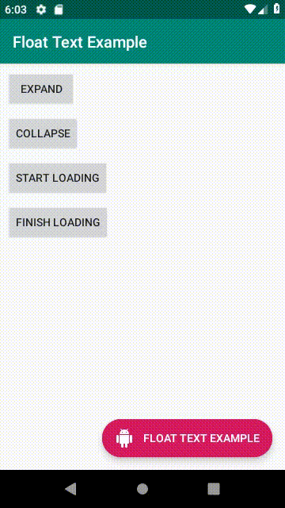

# Float Text

[](https://bintray.com/lucasgomes-eti/floattext/fabtext/_latestVersion)

A Custom implementation for android float action button where a text property and some other functions was added.



## Download

```groovy
implementation 'com.lucasgomes:fabtext:1.0.4'
```

## Getting Started

Add this to your layout file namespace:
```xml
xmlns:app="http://schemas.android.com/apk/res-auto"
```

Component declaration:

```xml
<com.lucas.fabtext.FabText
        android:layout_width="wrap_content"
        android:layout_height="wrap_content"
        app:text="@string/app_name"
        app:text_color="@android:color/white"
        app:icon_color="@android:color/white"
        app:color="@color/colorAccent"
        android:id="@+id/fabText"/>
```

XML Properties:

* text
* icon
* text_color
* icon_color
* color

### Expand/Collapse

After getting a reference from the component in your code you can just call **fabText.expand()** and **fabText.collapse()** to do the job, the animation are handle by the component.

You can use this with scroll view to collapse automatic when user is scrolling, this library is shipped with a custom scroll view that provides the events for your activity or fragment when user start and stop scrolling.

Observable Scroll View Declaration:

```xml
<com.lucas.fabtext.ObservableScrollView
            android:layout_width="match_parent"
            android:layout_height="match_parent"
            android:id="@+id/myScrollView"
            android:fillViewport="true">
```

In your activity or fragment you must implement this interface:

```kotlin
class MyFragment : Fragment(), ObservableScrollView.ScrollViewListener {
    myScrollView.setScrollViewListener(this)

    override fun onScrollViewTouchEvent(event: MotionEvent?) {
        when(event?.action) {
            MotionEvent.ACTION_DOWN -> {
                fabText.collapse()
            }
            MotionEvent.ACTION_UP -> {
                fabText.expand()
            }
        }
    }
}
```

### Loading

After getting a reference from the component in your code you can just call **fabText.startLoading()** and **fabText.finishLoading()** to do the job, doesn't matter if your fab is collapsed or not.